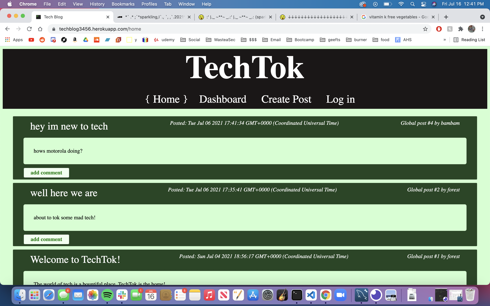
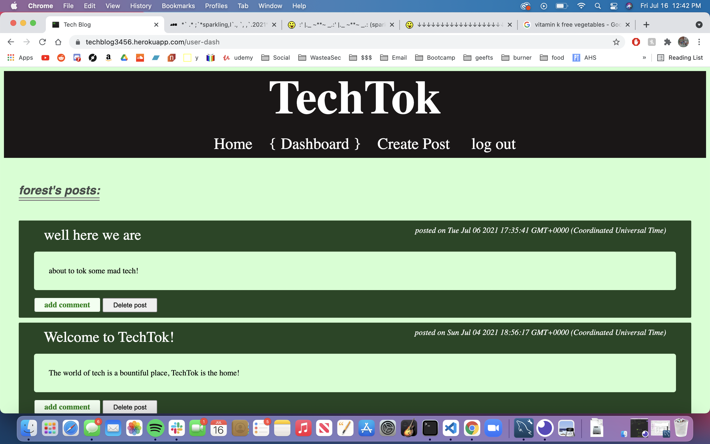
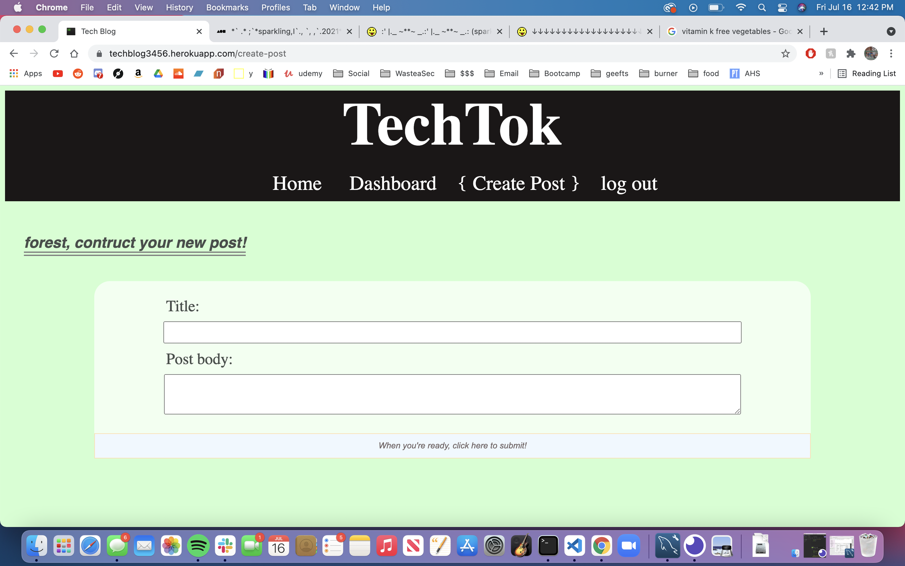
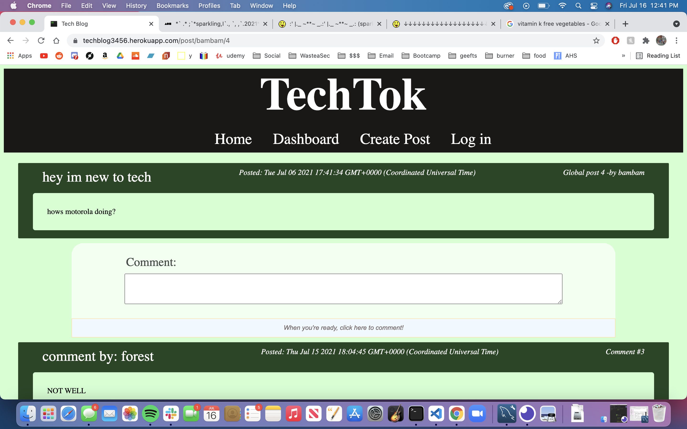
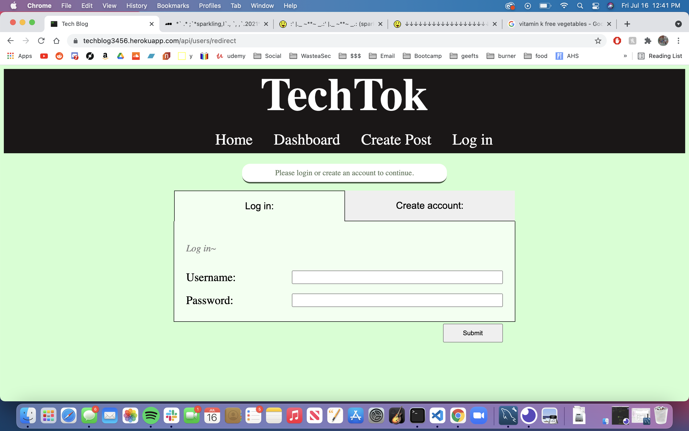

# Forest Wilson - Homework 14 - Tech Blog
MIT - (https://opensource.org/licenses/MIT) - For Good.

## Table of Contents:
- [Project description](#project-description)
- [Usage instructions](#usage-instructions)
- [Project installation](#project-installation)
- [Additional comments](#additional-comments)
- [Contribution information](#contribution-information)
- [Questions](#questions-or-concerns)
- [Extra](#extras)

### About This Project

* # Project description:
  Welcome to TechTok, a brand new blog site for users to talk about anything and everything tech. Create an account and start posting! The homepage will show you everyones posts sorted by most recent, and if you feel so inclined, you may leave comments as well! Use your user dashboard to see all of your posts, as well as delete the ones that you deem to cringy. When your done, be sure to log out, or if youre feeling lazy, just wait a while for your session to expire!

* # Usage instructions
  Use this application to create blog posts about your favorite tech and comment on other's interesting posts. Create an account to access site features.

* # Project installation
  * From repo:
    1. npm i 
    2. npm run mySql 
    3. npm run seed 
    4. npm start 
    5. Enjoy.
  
  * From site:
    1. Create an account / log in
    2. Go crazy.
     
* # Additional comments
  - tbh it was a little cruel to assign this right before the project 2 MVC, but after much debugging and frustration, I finally was able to get this deployed in a condition that I am happy with. That being said there are multiple things I either didnt get a chance to fix, or just didnt have time to implement.

  - I wish I would have utilized some bootstrap into the views to have a cleaner mobile display, but it was only until the end of development that I realized this, and it didnt seem worth it to go back and change stuff. as a result, on mobile there are some size issues pertaining to the site header, as well as the nav-bar links. I made a few media query changes to make it a little less obvious, but clearly not perfect. next time, I'll be baking in the bootstrap from the beginning.

  - boy was it frusterating to get all joined-table-values to populate correctly in my views, especially when it was populating on local but not on heroku. I was able to fix this by simplifying a lot of my code in the get routes, but I still am unsure why some tactics would result in split outcomes. the page that I had the most issues with was the homepage in populating the post's username, but thankfully I figured it out. also to access a "root" prop in my views coming from my controllers i had to... use '../'? that was surprising.

  - I would have liked to add a date formatting script so that the date-posted part of posts and comments didnt display as a full date with the time code and stuff, but I couldnt figure out where I could intercept that value and populate the new date. or store it as a string idk, for a future update.

  - I really liked what I did for the log-in page, where it transitions between the two tabs (log in and create an account), but for the life of me I couldnt figure out how to allign the tabs and the form perfectly ><

  - There is a bug that I've noticed where if you are on a specific screen and choose to log out, it will have you confirm, but then keep you the same page without changing anything. Expected performance will bring you through the confirm prompt, and then redirect you to the home screen where you can see that you are not logged in anymore. I may have fixed it with a patch, but I'm unsure if this was the solution. 

#### Contribution information 

- If you would like to contribute to this project, please follow best practices and message me at one of the provided contacts bellow if you want to push!

###### Questions or concerns? 
* Please contact me at one of the following!

  Email - Hexaforest@gmail.com
  gitHub - https://github.com/ForestW70/

# Extras

* Screenshots:
  
  
  
  
  

* Links:
  [Repo page](https://github.com/ForestW70/hw14techblog)
  [Live site](https://techblog3456.herokuapp.com/home)
